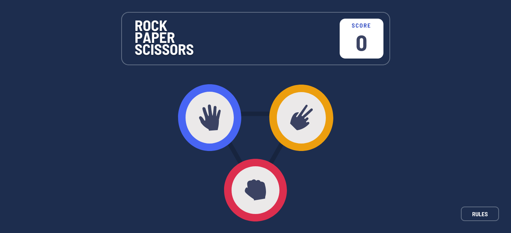
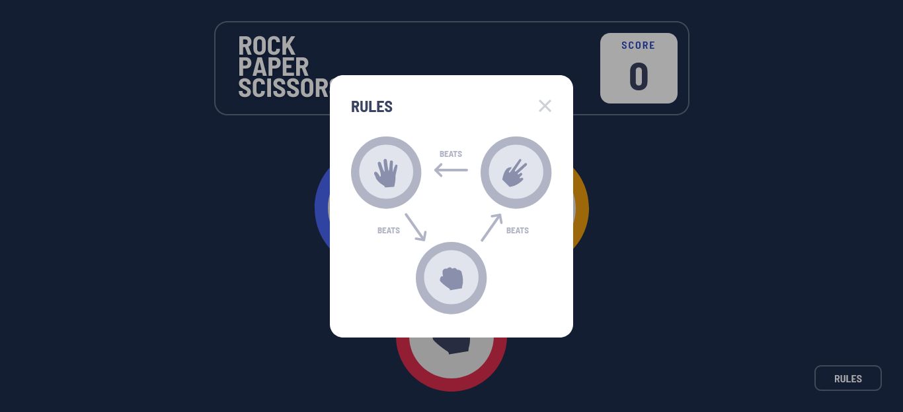
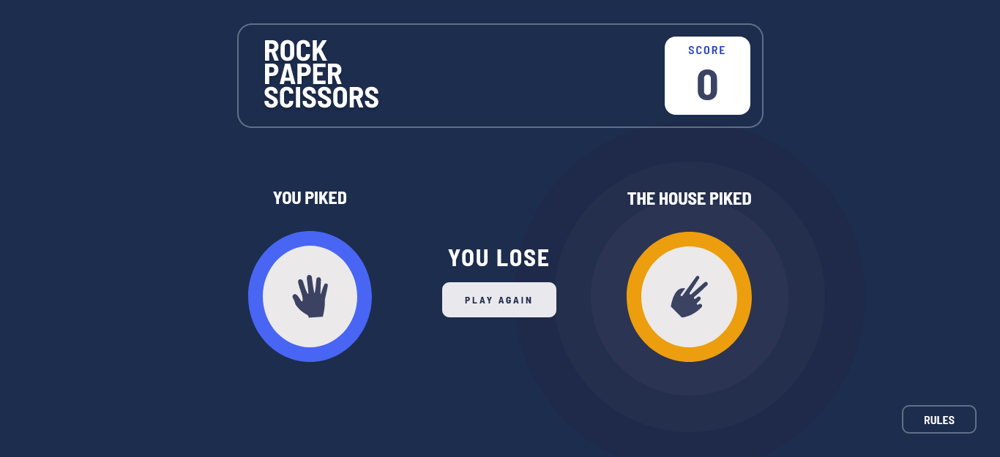

# Rock, Paper, Scissors

in this project I will be creating a Rock ,Paper, Scissors game.

### Screenshot

 
 

 
 

## The challenge

Your users should be able to:

- View the optimal layout for the game depending on their device's screen size
- Play Rock, Paper, Scissors against the computer
- Maintain the state of the score after refreshing the browser 

### Rules

If the player wins, they gain 1 point. If the computer wins, the player loses one point.

### Built with

- Semantic HTML5 markup
- CSS 
- JavaScript